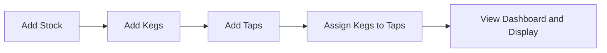

# BarTender Getting Started Guide

Last updated: 2026-08-20
Audience: first-time users

## Quick Setup

1. In Home Assistant, open Settings -> Add-ons -> Add-on Store.
2. Add repository URL: https://github.com/cjramseyer/BarTender
3. Install the BarTender add-on.
4. Start the add-on.
5. Open BarTender from the Home Assistant sidebar.

## First-Time Configuration

Open Settings in BarTender UI and set:

- Bar Name
- Default Keg Type (optional)
- Measurement (us or metric)
- Theme (light or dark)
- Printable Menu QR Mode (off, display, print, or both)

Recommended defaults:

- Measurement: us (if using US keg sizes) or metric based on your inventory.
- Theme: use the one with best readability on your display device.

## First-Use Workflow

Use this order for a clean initial setup:

1. Add bar stock items.
2. Add kegs.
3. Add taps.
4. Assign kegs to taps.
5. Verify display view.

### Step 1: Add Bar Stock

- Go to Bar Stock.
- Click Add Item.
- Enter name, category, quantity, unit, notes.
- Save.

### Step 2: Add Kegs

- Go to Kegs.
- Click Add Keg.
- Enter keg details (name, type, size, status, brewer, ABV/IBU, volume).
- Optional: add filled date and notes.
- Save.

Default behavior note:

- New kegs default status to empty unless you choose another status.
- New keg name is prefilled as Keg N based on existing keg names.
- Name/beer details are required only when status is full.

### Step 3: Add Taps

- Go to Taps.
- Click Add Tap.
- Enter tap number and optional label/notes.
- Save.

Default behavior note:

- New tap label is prefilled as Tap N based on existing tap labels.

### Step 4: Assign Kegs to Taps

- Edit a tap and select Assigned Keg.
- Save.

Auto-fill behavior note:

- When a keg is connected to a tap and tapped date is empty, tapped date auto-fills.
- Existing tapped dates are preserved.

### Step 5: Verify Display

- Check dashboard and taps page for current assignment.
- Open display service if using a wallboard.

### Step 6: Verify Printable Menu

- Open /menu from the top navigation.
- Confirm currently assigned taps and keg details are visible.
- If QR mode is enabled, verify the QR image loads.
- If QR is unavailable, install dependencies and restart runtime.

## Common Pitfalls

- Using ingress-only URLs from external clients: mobile may not reach them directly.
- Forgetting to back up data before major changes.
- Entering freeform status values outside expected set.
- Selecting replace import mode accidentally when merge is desired.
- Importing malformed backups that fail schema validation.

## Backup and Upgrade Basics

Before upgrading:

1. Export JSON backup from /api/export/json.
2. Optionally export ZIP archive from /api/export/archive.
3. Store backup outside the HA host.

After upgrading:

1. Start add-on.
2. Open dashboard and settings.
3. Validate taps, kegs, and stock counts.
4. Spot-check one record from each section.

Restore workflow:

1. Open Settings -> Import Data.
2. Select .json or .zip backup file.
3. Choose import mode:

- replace: overwrite all current data
- merge: upsert imported records by id

4. Review preview counts, confirm, and import.

## Quick API Smoke Test

Use browser or HTTP client:

- GET /api/settings
- GET /api/stock
- GET /api/kegs
- GET /api/taps

Expected:

- 200 responses with JSON arrays/objects.

## Troubleshooting and FAQ

See docs/troubleshooting-faq.md for detailed troubleshooting and common questions.
