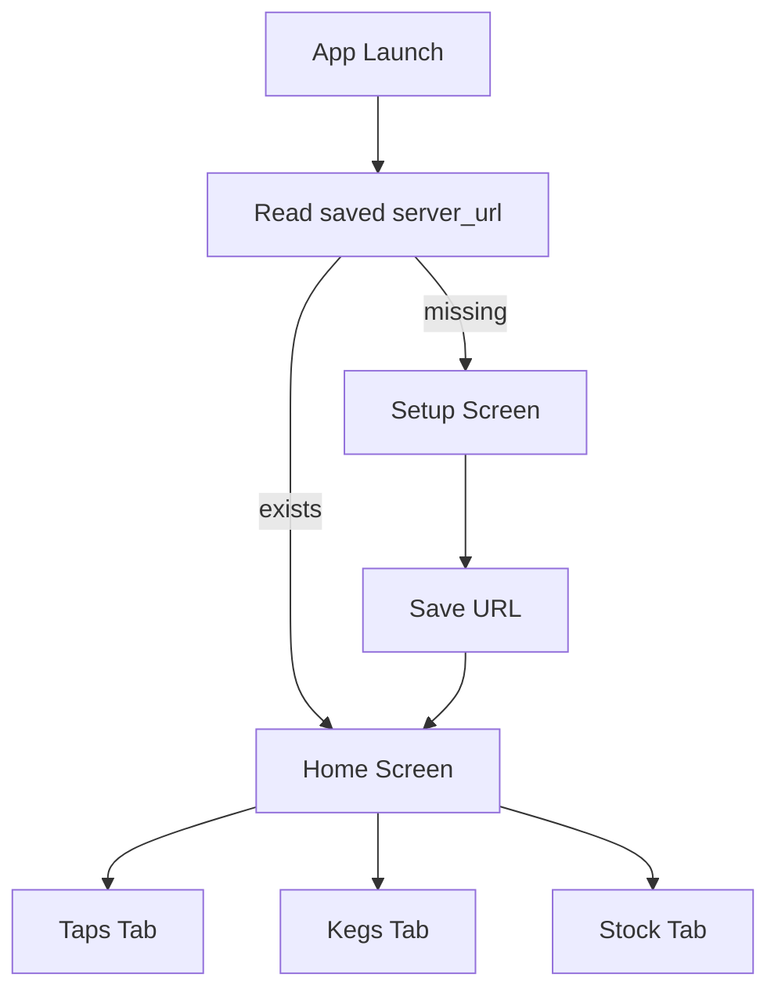

# BarTender Mobile App Documentation

Last updated: 2026-08-19
Doc scope: Flutter mobile viewer in mobile/

## Overview

The mobile app is a read-only viewer for BarTender data. It connects to the BarTender API and displays:

- Taps
- Kegs
- Bar stock

The app does not create, edit, or delete records at this time.

## Supported Platforms

From current Flutter project setup:

- Android (primary expected target)
- iOS (Flutter-supported, not explicitly configured in this repo)

Other Flutter platforms may compile, but are not documented/tested in this repository.

## Prerequisites

- Flutter SDK compatible with Dart >=3.3.0 <4.0.0
- A reachable BarTender server URL (Home Assistant ingress path is usually not directly reachable from mobile)
- Mobile device/emulator with network access to BarTender host

Project dependencies include:

- http
- shared_preferences

## Development Build and Run

From repository root:

1. Change directory to mobile.
2. Install packages.
3. Run on a device or emulator.

Example commands:

```bash
cd mobile
flutter pub get
flutter run
```

Optional validation:

```bash
flutter analyze
flutter test
```

## App Flow



## Configuration and Connectivity

Runtime setting:

- server_url: saved locally using SharedPreferences.

User setup behavior:

- On first launch, user enters server URL.
- URL is validated for scheme presence (http/https).
- URL is reused for future sessions until user disconnects.

Connectivity assumptions:

- Mobile device can reach the server URL over local network or internet/VPN.
- If Home Assistant ingress URL is private/session-scoped, use a directly reachable endpoint instead.

## API Usage by Mobile App

The mobile viewer reads from:

- GET /api/taps
- GET /api/kegs
- GET /api/stock

Failure behavior:

- Non-2xx status throws an exception.
- UI displays an error state with retry button.

Timeout behavior:

- Requests use a 10-second timeout.

## Feature Coverage

Implemented:

- Setup screen for server URL.
- Taps tab display with keg status badges.
- Kegs tab list with metadata chips.
- Stock tab grouped by category.
- Pull-to-refresh and retry affordances.

Not implemented:

- Authentication workflow.
- Write operations (add/edit/delete).
- Background sync or push notifications.
- Offline caching beyond saved server URL.

## Current Limitations

- Read-only by design.
- Error details are generic for end users.
- No in-app API diagnostics screen.
- No advanced connection profile support (multiple servers, cert pinning, etc.).

## Troubleshooting

Connection cannot be established:

- Verify server URL includes protocol (http:// or https://).
- Confirm phone and server are on reachable networks.
- Test URL in mobile browser first.

Server returns errors:

- Confirm add-on is running.
- Test GET /api/settings and GET /api/taps from another client.
- Check add-on logs for tracebacks.

Data appears stale:

- Pull to refresh on the active tab.
- Confirm the web UI shows recent updates.

Bad URL saved:

- Use Disconnect action in app bar to clear saved URL and reconfigure.

## FAQ

Q: Can I edit kegs/taps/stock from mobile?
A: Not currently. Mobile is read-only in this version.

Q: Can I point mobile at Home Assistant ingress URL?
A: Usually not from outside HA session context. Use a reachable network endpoint.

Q: Why do I see Server returned 4xx/5xx?
A: The API returned non-success status. Validate endpoint reachability and inspect add-on logs.

## Documentation Versioning

Update this file when:

- Mobile tabs/features change.
- API endpoints consumed by mobile change.
- Setup or dependency requirements change.
